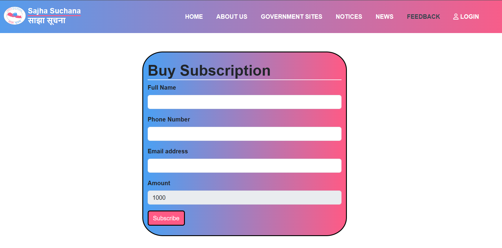

# Django News Portal System

## Description
This is a News Portal System made using Django and Bootstrap leveraging free API from various sources. It contains the following features:
<br>
1. Nepal Government Sites listed with their link
2. News Category
3. Subscription based government notice system
4. Login/Logout features for feedback
5. Easy to navigate UI
6. Selenium automated testing for login
7. Custom made logo.

## Installation
1. Clone the repository:
   ```bash
   git clone https://github.com/SumanGautam1/news-portal-system.git

2. Install the dependencies:
    ```bash
    pip install -r requirements.txt

3. Create a ```.env``` file in your root directory and configure your ```SECRET_KEY, KHALTI_KEY``` as well as ```NEPAL_API and API_KEY```.
    You can generate a secure key using:
    ```bash
    python -c 'from django.core.management.utils import get_random_secret_key; print(get_random_secret_key())'

You can get the ```KHALTI_KEY``` from khalti official documentation(optional for payment integration).
Get the ```NEPAL_API and API_KEY``` from [newsapi.org](https://newsapi.org/) and [newsdata.io](https://newsdata.io/) respectively.

4. Run migrations:
    ```bash
    python manage.py migrate

5. Create superuser for easier handling of data.
    ```bash
    python manage.py createsuperuser

6. Run migrations again:
    ```bash
    python manage.py makemigrations
    python manage.py migrate

5. Start the development server:
    ```bash
    python manage.py runserver

## UI Screenshots:
### Home Page
<p align="center">
  
  
</p>

### Government Sites Page


### News Page


### Payment Integration with Khalti
<p align="center">
  
  
</p>
